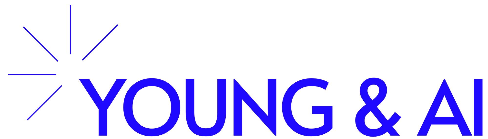

# Horizons (AI)

Change management and AI upskilling proposal for Horizons employees

August 2025

For internal discussion only

  
  

---
src: ./slides/toc.md
---

---
src: ./slides/01-executive-summary.md
---

---
src: ./slides/02-objectives-success-criteria.md
---

---
src: ./slides/03-high-level-strategy.md
---

---
src: ./slides/05-workplan-timeline.md
---

---
src: ./slides/sprint-breakdown.md
---

---
src: ./slides/08-candidate-pilot-backlog.md
disabled: true
---

---
src: ./slides/09-example-sales-outreach-workflow.md
disabled: true
---

---
src: ./slides/00-introduction-ching-youngin-ai.md
---

---
src: ./slides/14-effort-commercials.md
---

---
src: ./slides/16-summary-contact.md
---

